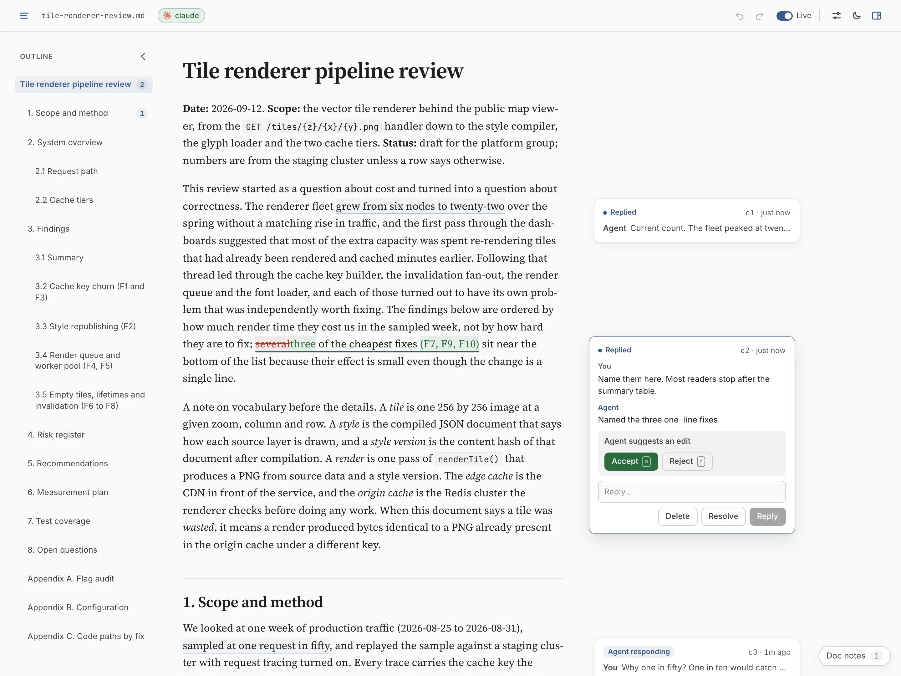
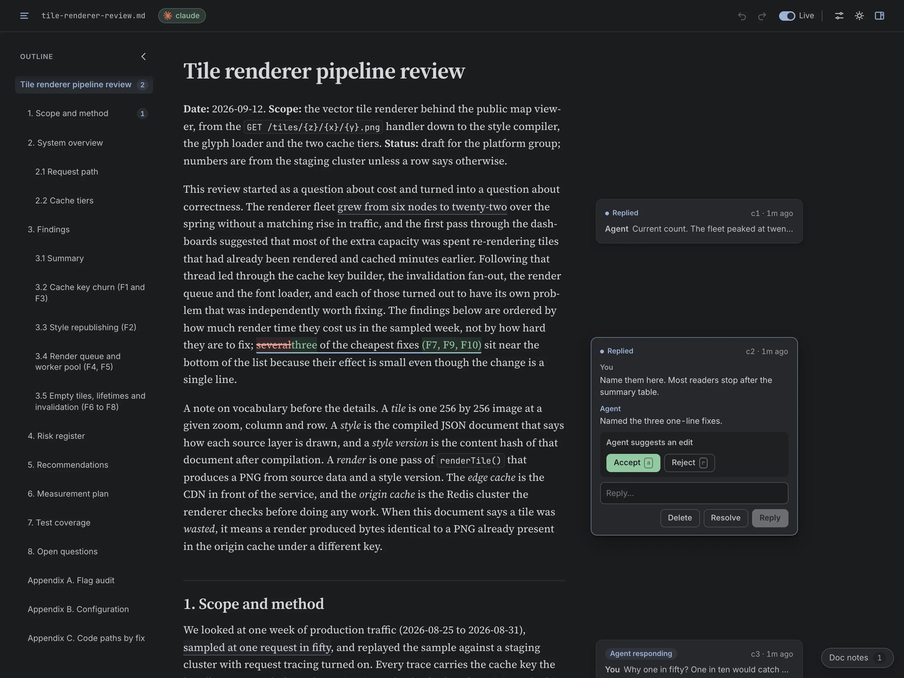

# margin

[](https://github.com/ariboren/margin/actions/workflows/ci.yml)
[](https://www.npmjs.com/package/margin-md)
[](LICENSE)

Review AI-written markdown like a Google Doc.

margin opens a markdown file in your browser as a document with a comment margin. Select text to comment on it or to suggest a change, and double click a paragraph to edit it in place. The agent that wrote the file answers through a small CLI: it replies in the thread and proposes edits that appear as inline diffs for you to accept or reject. The file stays plain markdown in your repo, with no ids or markers added, and the comments live in a sidecar beside it.

It is made for the long documents agents produce, such as plans and reviews, where a terminal diff or a chat window is the wrong place to read them. Any agent that can run shell commands can take part. Claude Code is tested end to end.



## Install

margin runs on [Bun](https://bun.sh) 1.3 or later (not Node), on macOS or Linux.

```sh
curl -fsSL https://bun.sh/install | bash   # if you don't have Bun
bun add -g margin-md
```

With Homebrew, `brew install ariboren/tap/margin` installs margin and Bun together.

To try it once without installing, run `bunx margin-md path/to/doc.md`. Agents call `margin` directly, so install it globally before connecting one.

## Quick start

```sh
margin setup           # once per project: installs the Claude Code skill
margin docs/plan.md    # opens the doc in a tab and prints its URL
```

Tell the agent the doc is open in margin. Select a sentence, press `c`, type a question and send it. The agent picks the thread up, and its reply or suggested edit appears in the margin. For agents other than Claude Code, see [Connecting an agent](#connecting-an-agent).

## Reviewing

**Comments and suggestions.** Select text and press `c` to comment or `s` to suggest a replacement. The same two buttons appear above the selection. Threads sit in the margin beside the text they quote, folded to a header with their state (draft, open, agent notified, agent responding, replied or resolved) until you click one open. A thread the agent picked up but hasn't answered in 10 minutes is marked stalled. If the quoted text is deleted the thread is marked detached, and it reattaches when the text comes back. After a rewrite, "Resolve N detached threads" in the top bar clears them in one step.

**Doc notes.** For a comment on the doc as a whole, open "Doc notes" at the bottom right or press `n`. Notes read like a chat with the agent and stay out of the margin. The agent gets them alongside your other threads and answers with a reply or an edit.

**Agent suggestions.** A proposed edit shows as an inline diff in the text. Accept writes it to the file and resolves the thread. Reject with a note sends the note back to the agent; reject without one resolves the thread.

**Editing.** Double click a paragraph to edit its markdown in place, or set "Edit blocks with" in settings to single click. An Editing chip at the foot of the page shows the keys: click away or press `⌘↵` to save, or `Esc` to cancel. Lists and tables are edited one item or cell at a time, and "Edit as source" opens the whole list or table. A save rewrites only that block's bytes, so `git diff` shows exactly what you changed. The agent gets your edits with your next comment or reply. With "Show resolved threads and edits" on, each save also shows in the margin as an "Edited by you" card, and "Add a note" on it turns the edit into a thread, for when the rest of the doc should change to match.

**Undo.** `⌘Z` and `⇧⌘Z`, or the arrows in the top bar, undo and redo your own edits and thread actions. A reply or resolve the agent has already read stays put.

**Live.** Comments reach the agent as you post them. Switch off Live in the top bar and new comments stay as drafts until you press "Send all".

**Agent edits.** By default the agent suggests and you decide, unless your comment asks it to make the change. Turn on "Auto-apply edits" in settings and every agent edit on the doc lands in the file without waiting for you. An applied edit is labelled "Changed by agent" and has a Revert button.

**Changes from elsewhere.** Edits from your editor, from git or from the agent show up in the tab, and comments re-anchor to the new text. If the block you're editing changes underneath you, a bar at the foot of the page offers "Keep mine" or "Take theirs".

**View.** The outline on the left counts open threads per section. The top bar hides the comment margin and switches between light and dark. Settings sets the text size and the page margins, which apply at any window width, and "Show resolved threads and edits" keeps finished threads and your edit cards in the margin.



### Keyboard

| Key                 | Action                                         |
| ------------------- | ---------------------------------------------- |
| `c`                 | Comment on the selection                       |
| `s`                 | Suggest a replacement for the selection        |
| `j` / `k`           | Next / previous thread                         |
| `a` / `r`           | Accept / reject the active thread's suggestion |
| `n`                 | Open or close doc notes                        |
| `⌘↵` (`Ctrl+Enter`) | Send a comment or reply, save an edit          |
| `⌘Z` / `⇧⌘Z`        | Undo / redo your own edits and thread actions  |
| `Esc`               | Cancel, close a panel, or deselect the thread  |

## Connecting an agent

The agent works through the `margin` CLI and nothing else. It never reads the sidecar and never rewrites the whole file. `margin agent-help` prints the complete instructions in 1,479 bytes; the Claude Code skill and the AGENTS.md snippet are generated from that text. They tell the agent to answer in the doc, as replies and suggestions, and to post in chat only when you've asked for updates.

**Claude Code.** `margin setup` installs the skill in the current project, `margin setup --user` installs it for all your projects. Run it again after upgrading margin. It won't overwrite a skill you've edited unless you pass `--force`.

```sh
margin setup           # .claude/skills/margin/
margin setup --user    # ~/.claude/skills/margin/
```

**Other agents.** `margin setup` also prints a snippet to paste into your `AGENTS.md`, which margin never edits itself. The same text is in [AGENTS.snippet.md](AGENTS.snippet.md). Any agent that can run shell commands can follow it, but only Claude Code has been tested end to end.

**Who is answering.** The page shows the connected agent beside the filename, with its name on every reply. The name comes from `--as <name>` on any margin command, else the `MARGIN_AGENT` environment variable, else the title of the Claude Code session running the command (the one in its tab, so a renamed session shows under its new name), else the client margin detects (Claude Code, Codex or Cursor, from the markers they set in their shells). Several agents on one doc each appear under their own name.

```sh
margin watch review.md --as foreman
MARGIN_AGENT=reviewer margin pending review.md
```

The chip is green while an agent is watching, amber when none is or a reply has stalled, and red if the page loses the daemon. With no agent connected, click it to copy a message that tells your agent to start watching the doc. The browser tab carries the same state as a coloured dot, which turns blue when a reply lands while you're in another tab, and the title counts them, as in "(2) review.md · margin".

**The loop.** Claude Code runs `margin watch` under its Monitor tool. It prints one line per batch of new comments. Agents without Monitor run `margin pending <doc> --wait` instead, which blocks until the next batch arrives.

```console
$ margin watch review.md
new c1 "5. Recommendations"
```

`margin pending` returns only the threads that need an answer, each with its quote in `[[ ]]` inside the surrounding text, plus any edits you made since the agent's last read.

```console
$ margin pending review.md
c1 open L139 5. Recommendations
  1. [[Ship F2 first, alone.]] It has no migration and the largest effect per line. Measure publishes per day and origin hit rate for a week before moving on, so the effect of F1 can be measured separately rather than blended.
  user: Alone, or can F6 ship in the same week?
```

The agent answers with a reply or a suggestion.

```console
$ margin suggest c1 --replace "Ship F2 first, alone, with F6 in the same week if the typed timeout error is ready." -m "F6 has no overlap with F2's measurement."
ok c1 replied
```

The suggestion appears in your tab as an inline diff. Accept it and the file changes. Reject it with a note and the note reaches the agent in its next batch. The other thread commands are `margin reply <id> "text" [--resolve]`, `margin resolve <id>` and `margin show <id>`, which prints the whole block and thread.

## Files and the daemon

Comments are stored in a `.margin/` directory next to the doc: `.margin/<doc>.jsonl`, an append-only event log, plus a lock file. Add it to your `.gitignore`:

```gitignore
.margin/
```

One background daemon serves every doc you open, one doc per tab. `margin <doc>` starts it or reuses the one already running, opens the tab at a readable address such as `http://127.0.0.1:<port>/d/212a0553/review.md`, prints its URL and exits. The daemon exits by itself after 30 minutes with no tabs open. Inside Orca the tab opens in Orca's built-in browser; anywhere else it opens in your default browser.

```sh
margin status    # daemon pid and port, then each open doc and its tab count
margin stop
```

When an agent runs `margin <doc>` (its output is not a terminal) and a tab already shows the doc, it prints the same URL and opens no second tab; from your terminal it always opens one. Set `MARGIN_NO_OPEN=1` to print the URL without opening a tab. The daemon keeps its port and token in `~/.cache/margin`, or in `$XDG_RUNTIME_DIR/margin` when that is set.

## Token cost

Output to the agent is kept small. Bytes of CLI stdout, measured by `bun run budget` on [`fixtures/public-sample.md`](fixtures/public-sample.md) (71,296 bytes); method and ceilings in [docs/budget.md](docs/budget.md).

| Output                                          | Bytes                    |
| ----------------------------------------------- | ------------------------ |
| `margin watch`, per batch                       | 20                       |
| `margin pending`, per thread (median)           | 310                      |
| `reply` / `suggest` / `resolve` acknowledgement | 16                       |
| `margin agent-help`                             | 1,479                    |
| 10 threads, full loop, all CLI output           | 4,755 (6.7% of the file) |

One real Claude Code session (Opus 5.5) resolved 12 threads on a 165,788-byte doc at about 2 requests and $0.05 per thread, at API prices.

## Verification

CI runs on every push to `main` and every pull request, and any failure fails the build.

- Byte-exact saves: round-trip tests on BOM, CRLF, a missing trailing newline, code fences and frontmatter, plus [fast-check](https://fast-check.dev) property tests that generate random edits and shrink any failure to a minimal case.
- Concurrency: 20 processes append to one comment log, take one lock and edit one doc at the same time without losing an event or interleaving a write.
- The agent loop end to end: a real daemon, a scripted user on its HTTP protocol and the agent answering through the CLI, checked down to the bytes in the file.
- Line-coverage floors on `src/` per layer: 99% core, 94% CLI and 89% server. The browser client is reported without one; browser checks and end-to-end tests cover it.
- A byte ceiling on every agent-facing command, from [`budget.json`](budget.json).
- The npm tarball packed, installed in a clean directory and run.
- Dependencies and actions updated weekly by Dependabot, actions pinned to commit SHAs, and [zizmor](https://docs.zizmor.sh) auditing the workflow on every run.

Run the same checks locally with `bun test`, `bun run coverage`, `bun run budget` and `bun run pack-check`. Known limitations are tracked in the [issues](https://github.com/ariboren/margin/issues).

## Security

The daemon listens on 127.0.0.1 only and requires a random per-daemon token. Docs are treated as untrusted input: raw HTML renders as text, the page's Content Security Policy allows only the daemon's own scripts, images load only from the doc's directory, and links open only text and document file types. Details and how to report a vulnerability are in [SECURITY.md](SECURITY.md).

## Licence

MIT. See [LICENSE](LICENSE).

## Trademarks

Claude is a trademark of Anthropic, PBC. OpenAI and Codex are trademarks of OpenAI. Cursor is a trademark of Anysphere, Inc. margin is not affiliated with or endorsed by any of them.
